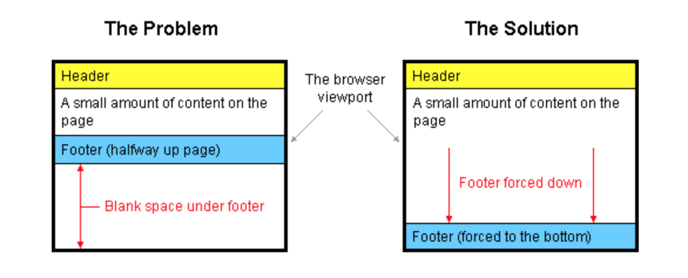
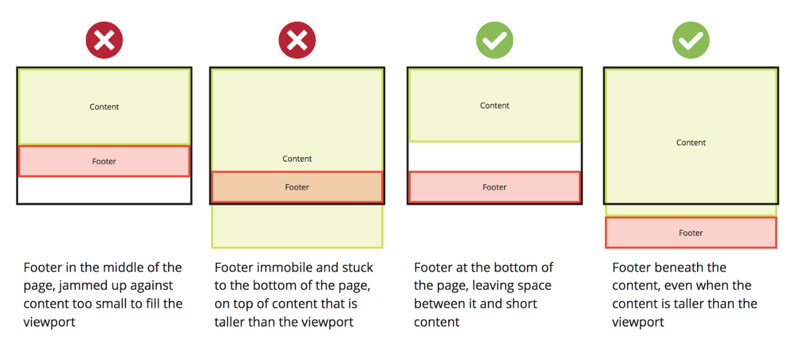

# How to keep footers at the bottom of the page

## The problem:

> When an HTML page contains a small amount of content, the footer can sometimes sit halfway up the page leaving a blank space underneath. This can look bad, particularly on a large screen. Web designers are often asked to push footers down to the bottom of the viewport, but it's not immediately obvious how this can be done.

  

  

> When I first ditched tables for pure CSS layouts I tried to make the footer stay at the bottom but I just couldn't do it. Now, after years of practice, I have finally figured out a neat way to do it.

> My method uses 100% valid CSS and it works in all standards compliant browsers. It also fails gracefully with older browsers so it's safe to use on any website.

> This is my solution!!!

> SO WHAT IS THIS DOING?

1. The `page-container` goes around everything on the page, and sets its minimum height to 100% of the viewport height (vh). As it is relative, its child elements can be set with absolute position based on it later.

2. The `content-wrap` has a bottom padding that is the height of the footer, ensuring that exactly enough space is left for the footer inside the container they are both in. A wrapping `div` is used here that would contain all other page content.

3. The `footer` is set to  `absolute`, sticking to the `bottom: 0` of the  `page-container` it is within. This is important, as it is not `absolute` to the viewport, but will move down if the `page-container` is taller than the viewport. As stated, its height, arbitrarily set to `2.5rem here`, is used in the `content-wrap` above it.
